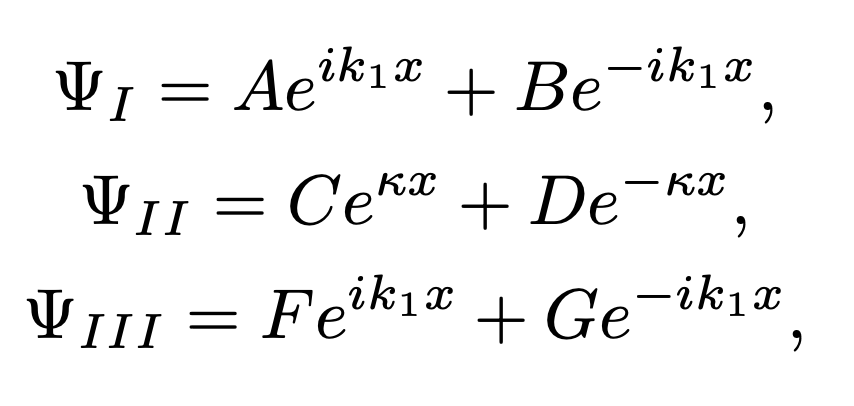
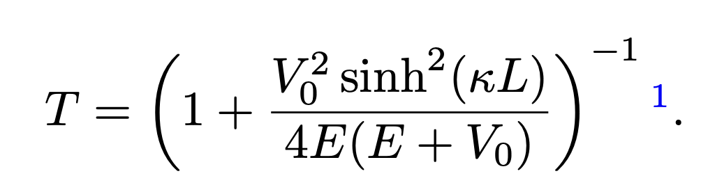

# Quantum Tunneling Calculation

## Abstract
This recitation presents a quantum mechanical calculation of the probability of electron tunneling between two closely spaced silicon wires. The calculation is based on the model of potential energy barriers and electron wave function behavior at the nanoscale.

## Introduction
Quantum tunneling defies classical mechanics by allowing particles to traverse a potential barrier, even without sufficient kinetic energy. This quantum phenomenon is described by the Schrödinger equation, which predicts the non-zero probability of a particle tunneling through a barrier.

When a particle with energy \( E \) approaches a barrier of height \( V_0 \), the wave function solutions for the regions outside and inside the barrier are given by:

where \( \kappa = \sqrt{\frac{2m(V_0 - E)}{\hbar^2}} \) in the classically allowed regions (I and III), and \( \kappa = \sqrt{\frac{2m(V_0 - E)}{\hbar^2}} \) in the classically forbidden region (II) when \( E < V_0 \). The tunneling transmission coefficient \( T \) is then calculated as:

This introduces the basis for calculating tunneling probabilities in quantum systems.

All equations on this page have been sourced from the reference [1].

### Reference
\[1\] Matthew Civiletti. *Modern Physics: a modern introduction*. 1st ed. 2023, p. 156.
